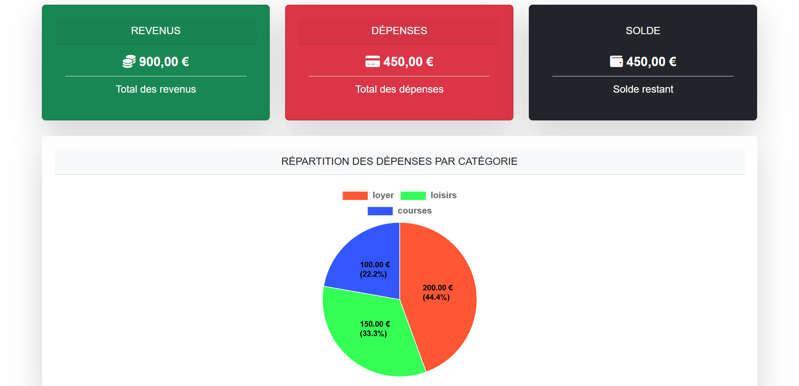

# MonBudgetÉtudiant

## But du projet
Gérer ses dépenses, générer des graphiques pour mieux visualiser et contrôler son budget étudiant.

## Technologies utilisées
- HTML  
- CSS  
- JavaScript  
- PHP  
- MySQL  

## Fonctionnalités principales
- Inscription des utilisateurs  
- Authentification sécurisée  
- Tableau de bord personnalisé  
- Gestion des dépenses et revenus  
- Visualisation graphique des données financières




## Installation

1. **Cloner le dépôt :**
   ```bash
   git clone https://github.com/ton-utilisateur/MonBudgetEtudiant.git
   ```

## Installation

### Configurer la base de données :
- Créer une base MySQL  
- Importer le fichier `database.sql` (ou équivalent)  
- Mettre à jour les paramètres de connexion dans le fichier de configuration PHP  

### Lancer le serveur local :
- Utiliser un serveur local type XAMPP, WAMP, MAMP ou équivalent  
- Placer les fichiers du projet dans le dossier `htdocs` ou `www`  
- Accéder au projet via `http://localhost/MonBudgetEtudiant`

### Utilisation :
- S’inscrire via le formulaire  
- Se connecter pour accéder au tableau de bord
